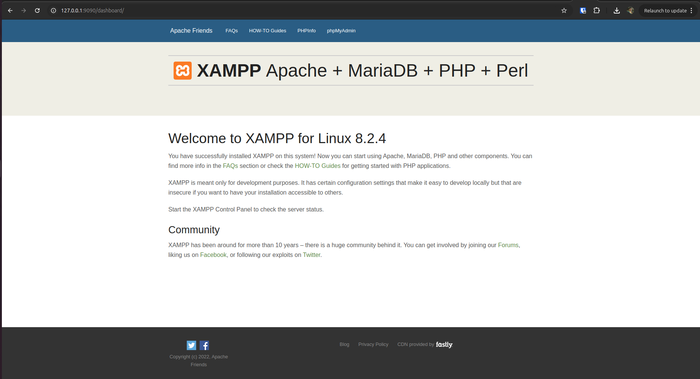

# Wordpress-Ecommerce
This projects is a simple demonstration of using Wordpress to create an ecommerce.

## Project setup using Docker:
* make sure to have docker installed on your machine.
* create a database inside the phpmyadmin. Ex: **ecommerce**
* create wp-config.php file under root directory and copy the contents of wp-config-sample.php to it
* modify the value of DB_NAME and DB_USER inside wp-config.php to **ecommerce** and **root**
* run _**docker compose up**_ to start the 'xampp service'.

## Usage:
* open _**127.0.0.1:9090**_ on your web browser and you will be redirected to xampp admin panel.
